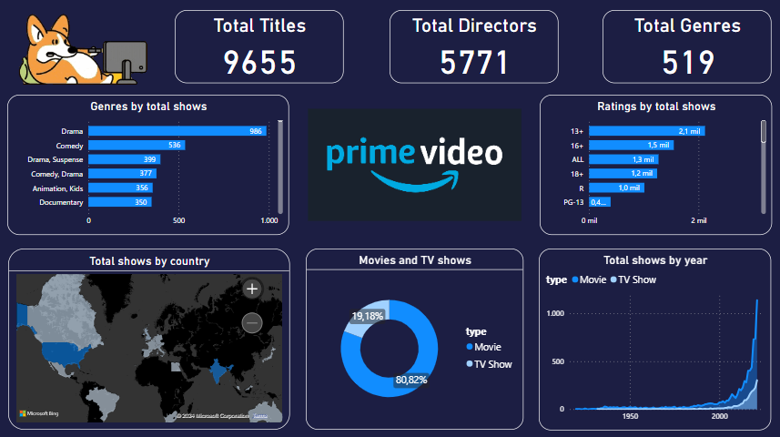

# Amazon prime video Dashboard with Power Bi

 📈 En 2021, Amazon Prime Video superó los 200 millones de suscriptores en todo el mundo 🌎, ofreciendo cerca de 10,000 películas y programas de televisión para tu entretenimiento.

📈 In 2021, Amazon Prime Video surpassed 200 million subscribers worldwide 🌎, offering nearly 10,000 movies and TV shows for your entertainment.

## Preguntas e indicadores claves | Key Questions and Indicators:

### ✅ Filtrado por Categoría y Ranking | Category Filtering and Ranking:
- Explora películas por género y calificación. ¿Qué tipo de películas prefieres ver?
- Explore movies by genre and rating. What kind of movies do you prefer to watch?
### ✅ Preferencias de peliculas o tv shows | Movie or TV Show Preferences:
- Descubre cual es la preferencia de la audencia. ¿Qué prefieren películas o tv?
- Discover the audience's preference. Do they prefer movies or TV shows?

## Dashboard:

## Data Sources:
https://www.kaggle.com/datasets/shivamb/amazon-prime-movies-and-tv-shows
